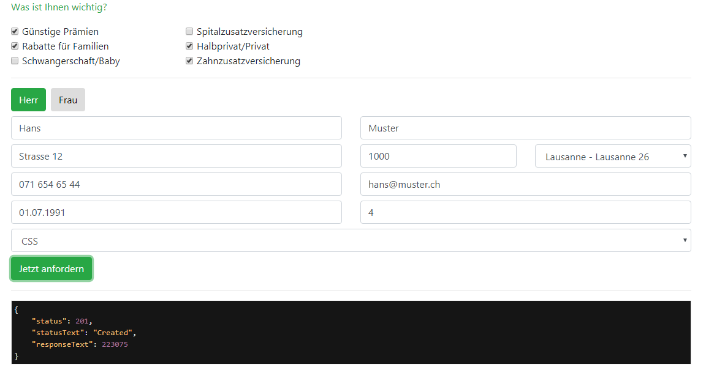

# Vue.js ile örnek lead formu

Projeyi indirin
index html içerisinde bulunan api tanımlama kod parçacığı üzerinde gerekli tanımlamaları yapın
``` js 
var api = new InsurandoAPI('<baseurl>', '<username>', '<password>');
```

Proje test'e hazır

İyi çalışmalar.
---
---
